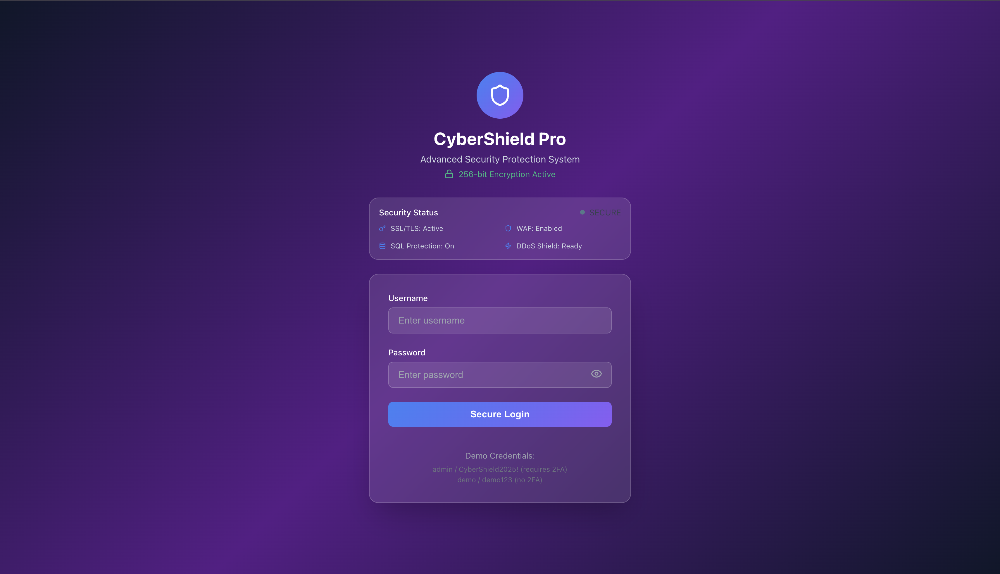
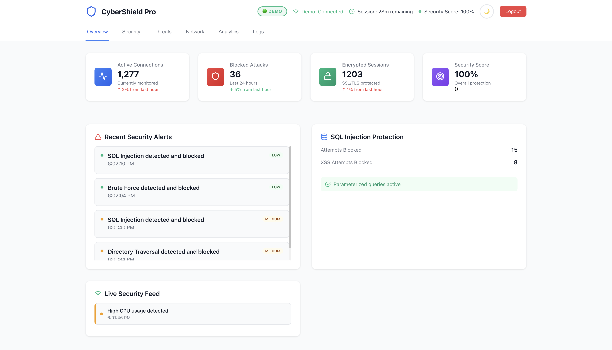
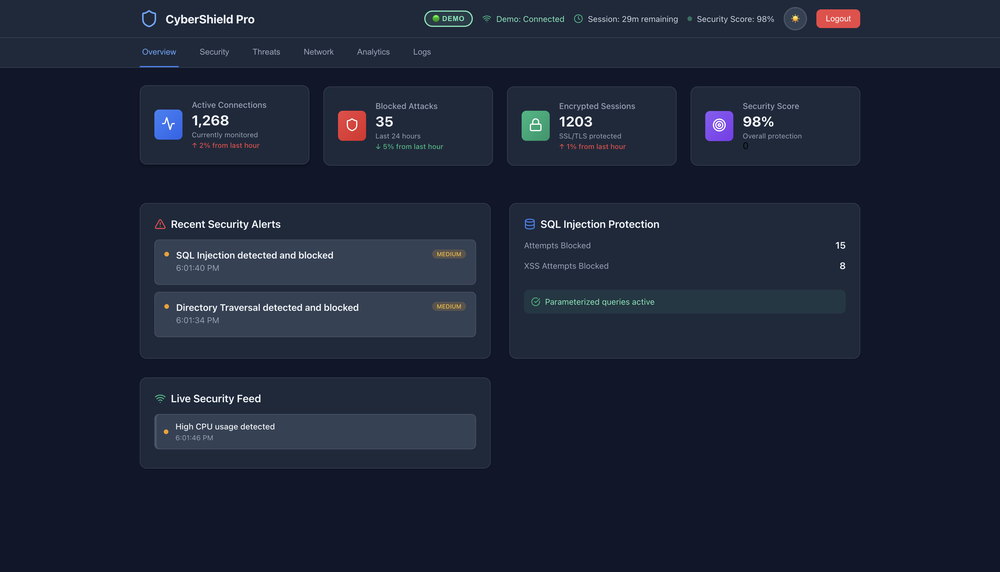

# CyberShield Pro 🔐

**CyberShield Pro** is a modern **React-based security dashboard** that simulates advanced cybersecurity monitoring and threat prevention.  
It demonstrates key **secure coding practices**, **real-time attack visualization**, and **user authentication** workflows, making it an ideal project for showcasing my **security-focused software engineering skills**.

---

## 🚀 Features

### **Authentication & Session Security**
- Secure login with **input sanitization** to prevent XSS & injection attacks.
- **Password strength validation** (uppercase, lowercase, numbers, special characters).
- **Rate limiting** (locks accounts after repeated failed attempts).
- **Session timeout** with automatic logout after inactivity.
- Demo accounts (`admin / CyberShield2025!` and `demo / demo123`).

### **Threat Detection & Monitoring**
- Simulated **real-time security stats**:
  - Active connections
  - Blocked attacks
  - SQL Injection attempts
  - XSS attempts
- **Live security alerts** (SQLi, XSS, brute force, unusual traffic).
- **Threat log** with attack vectors, payloads, and prevention methods.

### **Security Dashboard**
- Multiple tabs:
  - **Overview** – System health & security score.
  - **Security** – Configuration, policies, and encryption status.
  - **Threats** – Detailed list of blocked attacks.
  - **Network** – Firewall, DDoS, SSL/TLS configuration.
  - **Analytics** – Attack patterns and response metrics.
  - **Logs** – Recent security events.

### **UI/UX Enhancements**
- **Dark mode toggle** 🌙/☀️.
- Smooth animations & modern design.
- **Password visibility toggle** with strength indicator.
- Fully **responsive** layout.

---

## 🛠 Tech Stack

- **React (Hooks + Functional Components)**
- **Javascript**
- **Python (Backend functionality)**
- **Flask (Backend functionality)**
- **Lucide Icons** for modern security-theme.
- **Custom CSS** with dark mode support.
- **LocalStorage & SessionStorage** for state persistence.
- **Security utilities** (input sanitization, encryption simulation, CSRF token generation).
---

## 📸 Screenshots

### **Login Screen**


### **Dashboard Overview - Light Mode**


### **Dashboard Overview - Dark Mode**
 

---

## ⚡ Future Enhancements
- **WebSockets** for live threat data instead of polling.
- **AI-powered threat detection** (using TensorFlow.js).
- **Charts (recharts / chart.js)** for attack trends & analytics.

---

## 🔧 Getting Started

### **Prerequisites**
- Node.js (v14 or higher)
- Python 3.7 or higher
- npm or yarn

### **Clone and Setup**
```bash
# 1. Clone the repository
git clone https://github.com/DavisAdrian/Cybershield-Pro.git
cd Cybershield-Pro
```

### **Frontend Setup**
```bash
# 2. Navigate to frontend directory
cd cybershield-Frontend

# 3. Install dependencies
npm install

# 4. Start the React development server
npm start
```
The frontend will be available at `http://localhost:3000`

### **Backend Setup** (Optional - for live WebSocket data)
```bash
# 5. Open a new terminal and navigate to backend directory
cd cybershield-backend

# 6. Install Python dependencies
pip install flask flask-cors

# 7. Start the Flask server
python server.py
```
The backend will be available at `http://localhost:5001`

### **Demo Credentials**
- **Admin Account** (with 2FA): `admin / CyberShield2025!`
- **Demo Account** (no 2FA): `demo / demo123`

---
## 🤝 Contributing

Found a bug or have a suggestion? Contributions are welcome!

1. 🍴 **Fork** the repository
2. 🌿 Create a **feature branch**: `git checkout -b feature/amazing-feature`
3. 💾 **Commit** your changes: `git commit -m 'Add amazing feature'`
4. 📤 **Push** to branch: `git push origin feature/amazing-feature`
5. 🔃 Open a **Pull Request**

### **Contribution Ideas**
- 🎨 New color schemes or themes
- 🔒 Additional security features
- ♿ Accessibility improvements
- 📱 Mobile optimizations
- 🎭 Animation enhancements

## 📞 Support & Contact

**Need help or have questions?**

- 📧 **Email**: [adpersonals@gmail.com](mailto:adpersonals@gmail.com)
- 💼 **LinkedIn**: [Adrian Davis](https://www.linkedin.com/in/adrian-davis-bb6b82222/)
- 💻 **GitHub**: [@DavisAdrian](https://github.com/DavisAdrian)
- 🌐 **Portfolio**: [davisadrian.github.io](https://davisadrian.github.io/Portfolio-site/)

## 📄 License

This project is licensed under the **MIT License** - see the [LICENSE](LICENSE) file for details.

### **MIT License Summary**
- ✅ **Use** for personal and commercial projects
- ✅ **Modify** and distribute
- ✅ **Private use** allowed
- ⚠️ **Attribution** required
- ❌ **No warranty** provided
---
